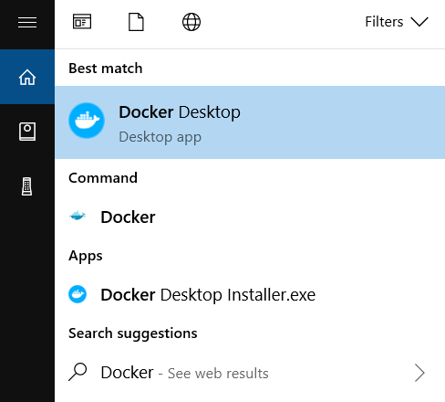

# Instalação do Docker no Windows

## Pré-requisitos

### Antes de começar a instalação, certifique de ter no mínimo:

- **Sistema Operacional:** Windows 10 ou superior.
  
- **Processador:** 64-bit
  
- **Memória:** 4 GB de RAM

### 1. Baixar o Docker Desktop

1. Abra seu navegador web e vá para a página oficial de download do Docker: [Docker Desktop](https://www.docker.com/products/docker-desktop).
   
2. Clique em "**Download for Windows**".

### 2. Executar o Instalador

1. Após o download, execute o arquivo `Docker Desktop Installer.exe`.

2. Siga as instruções do instalador. Quando a instalação for concluida, clique em "**Close**".

### 3. Finalizar a Instalação do Docker Desktop

1. Após a instalação do Docker Desktop, procure por Docker e selecione "**Docker Desktop**" nos resultados.
   

    


2. Durante a primeira execução, será solicitado para fazer login ou criar uma conta Docker.


### 4. Verificação da Instalação

1. Abra o terminal PowerShell (Terminal).
   
2. Execute o comando para verificar a versão do Docker instalada:
   
    ```bash
    docker --version
    ```

   Você deve ver uma saída semelhante a:
    ```
    Docker version 20.10.8, build 3967b7d
    ```


### 5. Testar o Docker

1. No terminal, execute o comando para rodar um contêiner de teste:
   
    ```bash
    docker run hello-world
    ```

   Este comando faz o download de uma imagem de teste do Docker Hub e executa um contêiner que imprime uma mensagem de "**Hello from Docker!**".

   

### 6. Verificação do Docker Engine

1. Execute o comando abaixo para listar todos os contêineres ativos. Se não houver containers rodando, retornará uma lista vazia:
   

    ```bash
    docker ps
    ```

2. Execute o comando abaixo para listar todos os contêineres, incluindo os que estão parados:
    ```bash
    docker ps -a
    ```